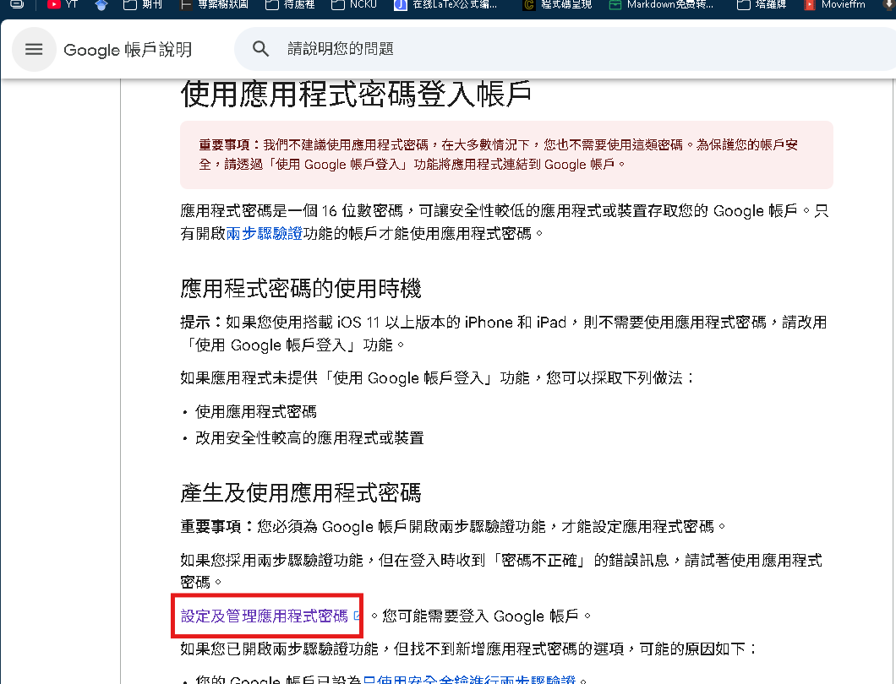
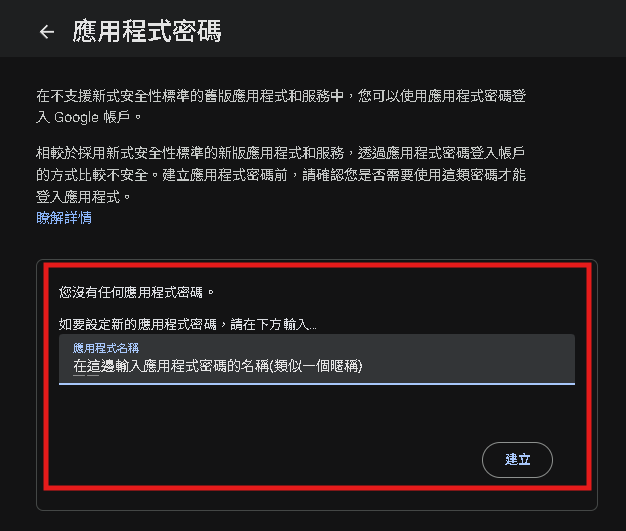
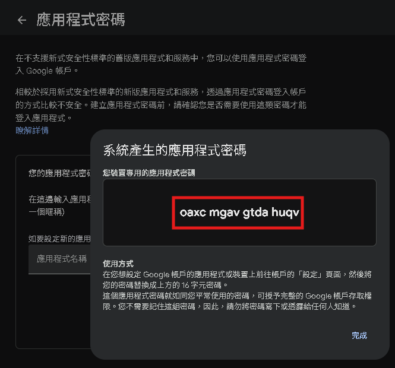

# Gmail

- [什么是SMTP 1080P 高清 AVC](https://www.youtube.com/watch?v=SRo7oL1kCeI)
- [自行瀏覽：Part12 - 什麼是郵件伺服器？ (Mail Server簡介與應用)](https://www.youtube.com/watch?v=ziGtmbljXeE)

## SMTP 協定：電子郵件傳送的基礎

SMTP 是 Simple Mail Transfer Protocol 的縮寫，中文是「簡單郵件傳輸協定」。它主要定義了網際網路上傳送電子郵件的相關細節。

### SMTP 伺服器的網域名稱

SMTP 伺服器的網域名稱通常就是電子郵件服務供應商的網域名稱。

- SMTP 伺服器的網域名稱通常就是電子郵件服務供應商的網域名稱。
- 下表列出了幾個常見的 SMTP 伺服器網域名稱範例：

| 公司        | SMTP 伺服器網域名稱                        |
| ----------- | ------------------------------------------ |
| HiNet       | `msxxx.hinet.net` (其中 `xx` 為伺服器編號) |
| Outlook.com | `smtp-mail.outlook.com`                    |
| Yahoo Mail  | `smtp.mail.yahoo.com`                      |
| Gmail       | `smtp.gmail.com`                           |

## [取得 Gmail 應用程式密碼](https://support.google.com/accounts/answer/185833?hl=zh-Hant)





## 安裝套件

```py
# 已經在uv sync一併裝好了
pip install gdown -q

uv add
```

## 撰寫 Python 程式碼寄送郵件

- [範例：連線發送至郵件伺服器](./Gmail_src/連線發送至郵件伺服器.py)

- [範例：啟用程式和SMTP郵件伺服器對話](./Gmail_src/啟用程式和SMTP郵件伺服器對話.py)
- [設定寄件相關資訊](./.env)
- [範例：發送簡單gmail](./Gmail_src/發送簡單gmail.py)

## MIME

我們在剛剛所使用的`smtplib`，本質就像郵差。那剛剛的範例其實就有點類似隨手拿一張白紙寫一寫就給郵差。同時，`smtplib`他只能使用ASCII編碼(就是只能寫英文跟數字)。

而MIME (Multipurpose Internet Mail Extensions) 就像是「標準化的包裹」。

- 可以在包裹（Email）裡放任何東西：中文信件、HTML、圖片、PDF 檔案。
- MIME 會在包裹外面貼上「標籤」，告訴收件人的 Email 軟體（如 Gmail）：「嘿！我這個包裹裡，第一層是純文字，第二層是一張圖片附件，第三層是一個 PDF 附件。」
- 這樣，Gmail 收到後就知道該如何正確地「拆開」並「展示」你的信件。


| 標頭          | 名稱                            | 解釋                                                                                                                                          |
| ------------- | ------------------------------- | --------------------------------------------------------------------------------------------------------------------------------------------- |
| `['From']`    | 寄件人                          |                                                                                                                                               |
| `['To']`      | 收件人                          | 如果要寄給多人，可以用逗號 `,` 隔開，例如：`'person1@a.com, person2@b.com'`。                                                                 |
| `['Cc']`      | 副本<br>(Carbon Copy)           | 這封信主要是寄給 `To` 的人，但我也想讓 `Cc` 的人看到這封信的內容<br>所有收件人都看得到 `Cc` 列表。                                            |
| `['Bcc']`     | 密件副本<br>(Blind Carbon Copy) | 這是 `Cc` 的秘密版本。`Bcc` 列表上的人會收到信，但是其他收件人 (To, Cc) 完全不會知道你把信也寄給了 `Bcc` 的人。非常適合用於保護收件人的隱私。 |
| `['Subject']` | 主旨                            |                                                                                                                                               |

- [範例：使用MINI發送純文字信件](./Gmail_src/使用MINI發送純文字信件.py)
- [範例：使用MINI發送HTML格式信件](./Gmail_src/使用MINI發送HTML格式信件.py)
    - [提示詞：將純文字信件轉成HTML格式信件](./Gmail_src/將純文字信件轉成HTML格式信件.txt)
- [範例：使用MINI發送圖片+純文字信件](./Gmail_src/使用MINI發送圖片+純文字信件.py)
- [範例：使用MINI發送附件+純文字信件](./Gmail_src/使用MINI發送附件+純文字信件.py)
- [範例：客製化行銷信件大量發送](./Gmail_src/客製化行銷信件大量發送.py)
- [範例：串接yfinance抓股票資料，寄送固定財經信件](./Gmail_src/串接yfinance抓股票資料，寄送固定財經信件.py)
    - [提示詞：串接yfinance抓股票資料，寄送固定財經信件](./Gmail_src/串接yfinance抓股票資料，寄送固定財經信件.txt)
