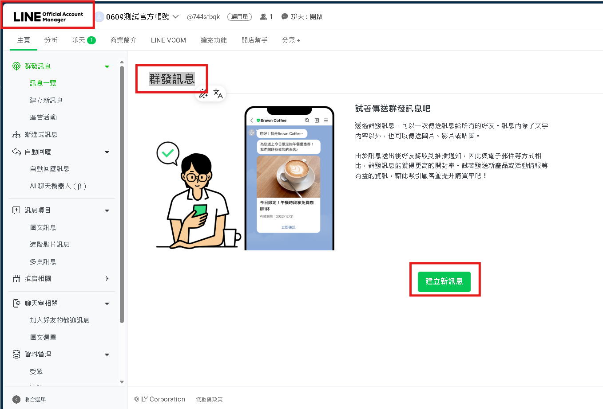

# Python LINE Bot

## 官方參考：

- LINE Messaging API overview: https://developers.line.biz/en/docs/messaging-api/overview/
- Receive messages with webhook: https://developers.line.biz/en/docs/messaging-api/receiving-messages/
- LINE Bot SDK for Python: https://github.com/line/line-bot-sdk-python

## [建立 LINE Developers Channel](./Line_Bot_PDF/在LINE%20中建立官方帳號&相關token.pdf)

## 建立env環境

打開 `.env`，填入 LINE 的 token：

```text
LINE_CHANNEL_ACCESS_TOKEN=你的token
LINE_CHANNEL_SECRET=你的secret
LINE_CHANNEL_ID=你的channel ID
```

## LINE Bot 核心觀念

LINE Bot 不是主動讀你的手機訊息，而是 LINE 平台在事件發生時，把資料送到你的 webhook。

常見事件：

- 使用者傳文字：`MessageEvent`
- 加好友：`FollowEvent`
- 點選 postback：`PostbackEvent`
- 使用者傳圖片、貼圖、位置等其他訊息

基本流程：

```text
使用者傳訊息 -> LINE 平台 -> 你的 /callback -> Python 判斷 -> 回覆 LINE -> 使用者收到
```

## 安裝套件

```
uv add python-dotenv
uv add flask
uv add line-bot-sdk
```

## [範例：Echo bot&取得UserID](./Line_Bot_src/echo_flask.py)

## 本機測試與ngrok公開

LINE webhook 需要 HTTPS。課堂常見用 ngrok取得 HTTPS URL

### ngrok 教學

1. [ngrok註冊](https://dashboard.ngrok.com/signup?utm_source=chatgpt.com)
1. [下載 ngrok](https://ngrok.com/download/windows?tab=install_winget)
    - Install ngrok via WinGet with the following command: `winget install ngrok -s msstore`
    - Add your authtoken: `ngrok config add-authtoken "<YOUR_AUTHTOKEN>"`
    - Start an endpoint: `ngrok http 5000`

### ngrok公開至LINE Official Account(官方帳號)

1. 在ngork會取得`https://91b7-2001-b400-e783-5fb1-c6d-b5fb-73e2-3eb7.ngrok-free.app`
1. 在LINE Developers 中選取chennel，在選到「Messaging API」
1. 下方Webhook URL填入`https://你的網域/callback`
1. 點即"verify"，要看到「成功」

## 發送文字訊息

### 方式1，利用Line官方帳號「群發訊息」



### 方式2，使用 Broadcast API

但是這個仍然會計入訊息額度。
假設：好友數：500人、群發：1次，那就是消耗500則訊息。

### 方式3，自己蒐集 UserID

- [群發給已記錄的使用者文字](<(./Line_Bot_src/群發給已記錄的使用者文字.py)>)
- [群發給已記錄的使用者文字+圖片](./Line_Bot_src/群發給已記錄的使用者文字+圖片.py)

## [Rich Menu：圖文選單](https://manager.line.biz/account/@744sfbqk/richmenu)

## [圖文訊息](https://manager.line.biz/account/@744sfbqk/richmessage)

## 多頁訊息：Flex Message卡片式版面

## [Quick Reply 選單](./Line_Bot_src/Quick_Reply校園小幫手.py)

Quick Reply 是聊天室底部出現的快捷按鈕。使用者不用輸入文字，只要直接點按鈕即可。

- [提示詞：Quick Reply 選單](./Line_Bot_prompts/Quick_Reply選單.md)

## 將訊息統整成csv，再透過python讀取

- PM 或行政人員可以改 CSV，不一定要改 Python
- 程式把資料載入後，可以搜尋關鍵字
- 這就是資料驅動設計的起點

- [範例：CSV 校園問答Line Bot](./Line_Bot_src/CSV校園問答Line_Bot.py)
- [範例：伽碩問答Line Bot](./Line_Bot_src/伽碩問答Line_Bot.py)
- [練習：小北百貨問答Line Bot](./Line_Bot_src/小北百貨問答Line_Bot.py)

## Line Bot串接Gemini API

最基礎的「使用者傳文字 → LINE Bot 收到 → 丟給 Gemini → 回覆到 LINE」來設計，最容易看懂，後面再慢慢加功能。

- [模型 | Gemini API | Google AI for Developers](https://ai.google.dev/gemini-api/docs/models/gemini-3.1-flash-lite?hl=zh-cn)
- [範例：Line Bot串接Gemini API基礎版](./Line_Bot_src/Line_Bot串接Gemini_API基礎版.py)
- [提示詞：LINE Bot + 角色設定](./Line_Bot_prompts/LINE_Bot+角色設定.txt)
- [範例：基於LINE Bot + Gemini API實作AI月老顧問](./Line_Bot_src/基於LINE_Bot+Gemini_API實作AI月老顧問.py)
- [範例：AI塔羅牌解籤老師回覆](./Line_Bot_src/AI塔羅牌解籤老師回覆.py)

## 後續可以延伸功能

- line bot SDK login
- LIFF
