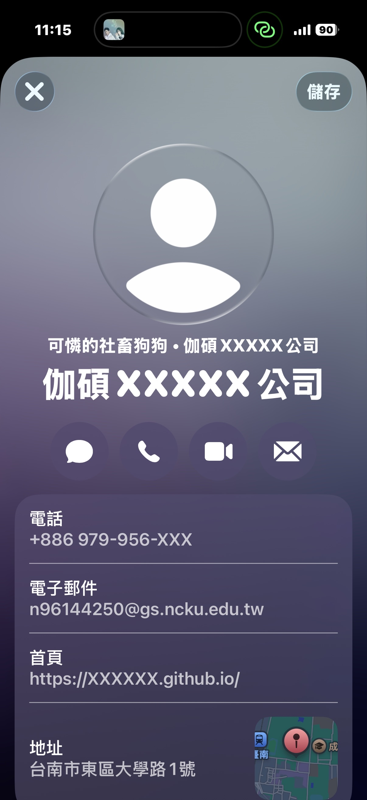

# Qrcode

> 補充：
> 電腦讀取qrcode 線上工具：https://zxing.org/w/decode.jspx


## Barcode

### 安裝套件

```py
# !pip install python-barcode -q

uv add python-barcode
```

- [範例：查看所有支援的條碼類型](./Qrcode_src/查看所有支援的條碼類型.py)
- [EAN-13條碼要素：從基本理解到生成](https://zh.onlinetoolcenter.com/blog/EAN-13-Barcode-Essentials-From-Basic-Understanding-to-Generate.html)

### 不同條碼格式，能存的東西差很多

| 條碼格式 | 可存英文 | 可存中文 | 可存數字 | 常見用途  |
| -------- | -------- | -------- | -------- | --------- |
| EAN13    | ❌       | ❌       | ✅       | 商品條碼  |
| UPC      | ❌       | ❌       | ✅       | 美國商品  |
| Code128  | ✅       | ❌       | ✅       | 物流/倉儲 |
| Code39   | ✅       | ❌       | ✅       | 工業      |
| QRCode   | ✅       | ✅       | ✅       | 網址/文字 |

### 補充：查看SVG與PNG


- [SVG or PNG? Must-Know Tips for Crystal Clear Designs!](https://www.youtube.com/watch?v=bE98tqXUJaU)
- [Vibe Coding 玩家必備的 SVG 進階操作指南](https://www.youtube.com/watch?v=qSiu53ChHeE&t=70s)

- [範例：建立一個條碼，轉成svg](./Qrcode_src/建立一個條碼，轉成svg.py)
    - 優點：無限放大不失真，適合印刷。
    - 缺點：一般圖片檢視器可能打不開。
- [範例：建立一個條碼，轉成png](./Qrcode_src/建立一個條碼，轉成png.py)
    - 優點：通用圖片格式，大家都能開。
    - 關鍵：必須加上 writer=ImageWriter() 參數
- [補充：可以拿來測試EAN13的數字碼](./Qrcode_datasets/可以拿來測試EAN13的數字碼.txt)

- [實作：Python + Gradio barcode條碼產生](./Qrcode_src/Python_Gradio_barcode條碼產生.py)
    - [提示詞：Python + Gradio barcode條碼產生](./Qrcode_src/Python_Gradio_barcode條碼產生.txt)

## Qrcode

QR Code (Quick Response Code) 是一種二維條碼，由日本 Denso-Wave 公司在 1994 年發明。它的名稱意思是「快速反應」，因為它設計用來讓掃描器能夠快速讀取其內含的資訊。

QR Code常見的例子包括：

- 顯示網址資訊：掃描 QR Code 即可直接進入網頁。
- 行動支付：消費者掃描商家或個人的 QR Code，就能快速完成支付。
- 電子票券：如展覽、高鐵、電影票等，將資訊儲存在 QR Code 中，掃描後即可入場。
- 文字資訊：儲存名片資訊、產品說明等文字內容，方便快速獲取。

- [QR code的歷史：日本發明影響全球，小小黑白格大大奧秘【TODAY 看世界｜小發明大革命】](https://www.youtube.com/watch?v=zOx-JpBH-UM&t=222s)
- [二維碼 QR code 的原理是什麼?](https://www.youtube.com/watch?v=rLAv85l4fqk)
- [❄️ 設計生活冷知識❄️ QR Code 設計靈感竟然來自圍棋 !?｜說哈設計 Show Hand Design](https://www.youtube.com/watch?v=7Qcap43XOKA)
- [Vol.120 二維碼的秘密](https://www.youtube.com/watch?v=XW8sgT_D0To&t=475s)

### 安裝套件

```
# !pip install qrcode -q

uv add qrcode
```

### QR Code 的結構


### 容錯功能 (Error Correction)


### QR Code 的容量

QR Code 有 40 個不同版本，版本 1 是 21x21 個模塊，每增加一個版本，長寬各增加 4 個模塊。因此，版本 40 的 QR Code 大小是 177x177 個模塊。

根據資料類型和容錯等級，QR Code 的最大資料容量不同：

- 數字：最多 7089 個字元。
- 字母：最多 4296 個字元。
- 二進位數字：最多 2953 個位元組。
- 日文漢字/片假名：最多 1817 個字元 (Shift JIS 編碼)。
- 中文漢字：最多 984 個字元 (UTF-8 編碼)，或最多 1800 個字元 (big5/gb2312 編碼)。


### 建立 QR Code 基本方法

```python=
# 函式會自動設定好所有參數，直接將文字內容轉換成 QR Code 圖片物件。
img = qrcode.make(codeText)
```

- [範例：將連結做成QRcode](./Qrcode_src/將連結做成QRcode.py)
- [範例：客製化QRCode](./Qrcode_src/客製化QRCode.py)
- [範例：在 QR Code 內加入圖片](./Qrcode_src/QRCode內加入圖片.py)
  由於 QR Code 有容錯功能，所以你可以在中間加上小圖案。


### VCARD

vCard 格式的資料，它是一種用於儲存和交換個人聯絡資訊的電子名片標準。簡單來說，vCard 就像是你的手機聯絡人資料，但以純文字格式呈現。

- [vcard是什么格式？如何进行转换？难吗？](https://zhuanlan.zhihu.com/p/690935297)
- [How to Create Your Own VCard QR Code](https://www.youtube.com/watch?v=XlhrOE2cGVU)
- [範例：建立名片資訊QRCode](./Qrcode_src/建立名片資訊QRCode.py)




