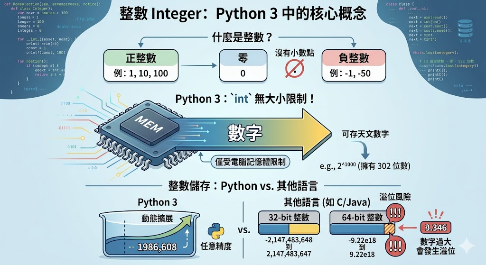

## type()：查詢資料型態

在開始學不同資料型態前，我們需要一個工具來確認我們手上拿的到底是什麼。Python 提供了一個超好用的`type()` 函式。

```py
score = 95 # 整數 (int)
print(type(score))
# <class 'int'>

pi_value = 3.14159 # 浮點數 (float)
print(type(pi_value))
# <class 'float'>

slogan = "顏面神經失調" # 字串 (str)
print(type(slogan))
# <class 'str'>
```

## Integer

- 就是沒有小數點的數字，正數、負數、零都可以。
- 在 Python 3 中，int 沒有儲存大小限制！你可以存一個天文數字，只要你的電腦記憶體夠大就行。

> 在其他程式語言中，整數通常會有儲存空間大小限制（例如 32 位元整數範圍：-2,147,483,648 到 2,147,483,647）。



## Float

- 帶有小數點的數字，例如 1.0、48.52、−0.001。
- 在其他程式語言中，可以再進一步分為【單經度浮點數float】與【雙經度浮點數double】。
- 在 Python 中，其實只有一種浮點數類型：float，它對應的是雙精度浮點數（double precision）。

### 常用數值運算函式


## String：字串

```py
name = '我叫程式小精靈'
quote = "不對歐，這樣不對耶"

my_sentence = "講師說 '我會了！'，然後繼續發呆。"
print(my_sentence)
```

```py
### 字串加法
first_name = "小"
last_name = "明"

# 字串連接：姓名加上空格
full_name = first_name + " " + last_name
print(f"我的全名是: {full_name}")
```

```py
### 字串乘法
warning = "🚨" * 5 + " ⚠️ 系統異常！請勿操作 ⚠️ " + "🚨" * 5
print(warning)
```

### 多行字串

```py
poem = """
黑夜給了我黑色的眼睛
我卻用它尋找光明。
—— 顧城
"""

print(poem)
```

### Escape Characters：逸出字元


```py
text1 = "第一行\n第二行"
print("--- 換行範例 ---")
print(text1)

text2 = "姓名:\tAllen\n職位:\t講師"
print("--- Tab 範例 ---")
print(text2)
```

### 原始字串 r

在字串前加  r  可忽略逸出字元效果（常用於路徑表示）

```py
print(r"C:\new_folder")
# print(r"C:\new_folder")
```

## byte：二進位資料


### 寄件與收件的兩大動作：打包與拆包


```py
name = '我今年3歲'
print(f"原始字串長度 (字元數): {len(name)}") # 輸出: 5

# 步驟 1: 字串 'str' -> 二進位 'bytes' (打包/編碼)
name_bytes = name.encode('utf-8')
print(f"打包後: {name_bytes}")
print(f"bytes 長度 (位元組數): {len(name_bytes)}")

# 步驟 2: 二進位 'bytes' -> 字串 'str' (拆包/解碼)
name_unicode = name_bytes.decode('utf-8')
print(f"拆包後的字串: {name_unicode}")
```

## [練習題目](./資料形態_practice/練習題目.ipynb)

<p style="text-align: center;">Copyright © 2025 Wei-Cheng Chen</p>
